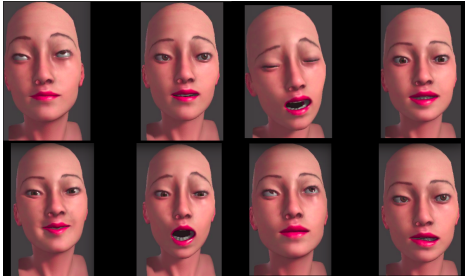
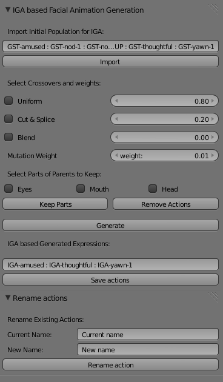
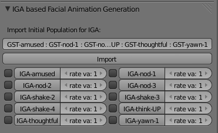
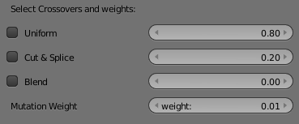
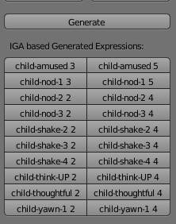
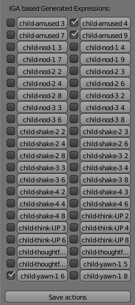
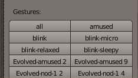
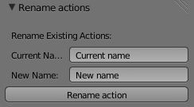

# Sophia Robot's Blender Animation API #

This repository contains an animated model of the Sophia head, as a
Blender file, as well as a Robot Operating System (ROS) node to control
the model.  The ROS node is automatically started when the blender
file is loaded.

The rigControl python module contains scripts to drive the model, as
well as defining a public programming API.  The rosrig python module
contains ROS node implementation.  The rigAPI module defines an abstract
base class for controlling the rig: the ROS node uses this API, and
rigControl implements it.

# Running #

Pre-requisites: The code is designed for Blender 2.72 or higher.
Start blender as follows:
```
blender -y Sophia.blend -P autostart.py
```
Sophia can be controlled via buttons in the blender GUI (note the panel
on the right). 


All animation sequences and 3D data are stored in the Blender file.

## How to Use the Blender API 3D Facial Animation Evolver GUI. 

### Sample Screen Captures Some of the 3D Human-like Facial Expressions Animations Generated via the Interactive Genetic Algorithms API



The descrptions below highlight the included components and their respective UI in order to enable users/developers run experiments using the animation evolver tool's GUI.
 

* The screen capture above shows what the full UI interface of the Evolver GUI looks like in general.

### Description of Each UI Parts:
 
**Import Parent Animations:**


* In the provided text box initial list of actions which will participate in the animation evolution process are provided; also users can change list of actions provided in the list as long as they provide animation names that are found in the blender instance (there is no limit to the number of actions/animations they can include).
The general format is to use is:
Actionname1: actionname2 : actionname3 etc. 
 
**After the Default Import of Parent Animations:**


* After users enter list of actions they want to include in the evolution process then they hit the import button which will list down actions into a button along their tick their buttons and their rate value (default value is 1). 
The above screen capture shows a scenario of import button hit with only when list of actions provided by default are used.

**Crossovers and Mutation:**



* There are three types of crossovers techniques provided in the evolver; namely uniform, cut & splice and blend operators. The details of these algorithms in general can be found on different websites such as wikipedia.
Users can tick one or two of the crossovers and decide their weight. Where the maximum total weight is 1.

* Mutation is done on all animations that are rated 0. The weight amount determines the strength of the mutation on the action. It is generally adviced to keep its value lower (default value provided is 0.01).
 
**Select Interesting Facial Parts of Animations and Remove Less Prefered Animations:**


* Once the crossover type/s and weight are decided, then select parts of facial parts is provided. 
There are three tick boxes; eyes, mouth and head. The user can select any number of actions in from the list (by ticking) and select parts (such as eyes, mouth and head) and finally hit the button Keep Parts.
These keeps parts of the selected animations to be kept without changing during a generation.
It is possible to do multiple selection of actions and tick the provided parts before doing the generation process.

* Each selection process will saved as long as the action and its selected part is unique. So this also means redoing the same process doesn't affect the array in any way.
Note that this functionality is provided for the uniform and blend operators. The reason it isn't provided for cut & splice is because its breeding style is basically parts based(such as eyes, mouth and head). So allowing to keep parts during this crossover would mean to see only very little movement during the evolution process.

* Remove button allows users to tick actions from the population list and remove it immediately. This functionality would be handy when action/s needs to be removed from the parent population list due to its poor significance to the next evolution process (or due their/its unfulfillment of any criteria the experimenter set) since every newly generated animations is automatically replaces the list of population/parents.

**Generate/Evolve child animations:**


* After making sure the above procedures are done, hitting the Generate button would generate/evolve a new set of animations. 
Two of the procedures that must be done before being able to evolve are; one is to import initial set of population/parents (at least during the first generation process) and second is to select either one or two of the crossover operator provided. 
Process such as selecting facial parts from the parents and remove parent/s are optional.


**Sample Evolved Animations:**



* Note that all previous parents are always copied to a new list and 'child' and their generation number appended to their names as shown above.
The latest generation always replaces automatically the list where the parents were. A sample of copied parents few generations is shown above.

**Save Evolved Animations:**



* Users can select list of evolved actions they want to save permanently. Once the users selects the list of animations and clicks the save buttons, in order to finalize the saving process (make it permanent within the .blend file) the .blend file needs to be saved (or 'save as' would be better, so as not to change the original .blend file) before closing the blender instance. 
When re-opening the new blend file, the selected evolved animations would be found at the GST-actions panel with a prefix 'Evolved' appended to their names. 



* Sample of evolved animations merged to the GST-actions panel.

**Rename Animations:**



* In order to rename an action just enter its current name in the 'Current name' text box and its new name in the 'New name' textbox and hit Rename actions button. This would rename the action. 

